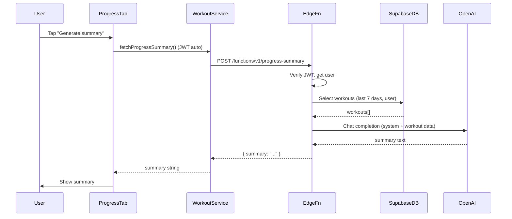

# Progress Summary Backend (OpenAI + Supabase Edge Function)

## Architecture

- **Trigger**: User taps "Generate progress summary" in the app (no automatic generation).
- **Backend**: One Supabase Edge Function (Deno/TypeScript) that reads JWT, fetches last 7 days of workouts from Postgres, calls OpenAI with a fixed "personal trainer" prompt, returns the summary text.
- **iOS**: Progress tab shows a button to request the summary and a scrollable area for the result; uses existing [SupabaseService.swift](FitnessApp/SupabaseService.swift) client (JWT sent automatically on `functions.invoke`).

---

## 1. Supabase Edge Function: `progress-summary`

**Location**: Create `supabase/functions/progress-summary/index.ts` (requires Supabase CLI: `supabase init` then `supabase functions new progress-summary` in the repo root).

**Responsibilities**:

- **Auth**: Read `Authorization: Bearer <token>` from the request. Use Supabase JS `createClient(SUPABASE_URL, ANON_KEY, { global: { headers: { Authorization:` Bearer ${token} `} } })` so the client runs as the logged-in user; then use `supabase.auth.getUser(token)` (or `getClaims`) to get user id and validate the token. Return 401 if invalid/missing.
- **Data**: Query `workouts` for the last 7 days. Use the same client (with user JWT) so RLS limits rows to that user. Filter with `.gte('created_at', <ISO string for now - 7 days>).order('created_at', { ascending: false })`. Map rows to a simple structure: type, duration_min, intensity, mood_before, mood_after, notes, created_at.
- **OpenAI**: Get `OPENAI_API_KEY` from `Deno.env.get('OPENAI_API_KEY')`. Call OpenAI Chat Completions (e.g. `gpt-4o-mini` or `gpt-3.5-turbo`) with:
  - **System prompt**: Instruct the model to act as a personal trainer; summarize the last 7 days using the provided workout list; explain which workout types tend to improve or lower mood, what seems to be working well vs not, and give 1–2 short, actionable suggestions. Keep tone encouraging and specific to the data.
  - **User message**: A formatted string or JSON of the workouts (type, duration, intensity, mood before/after, notes, date) so the model can reason about patterns.
- **Response**: Return JSON `{ "summary": "<assistant message content>" }` with 200. On errors (no data, OpenAI failure, etc.) return appropriate status and a short `{ "error": "..." }` body.

**Secrets (Supabase dashboard or CLI)**:

- `OPENAI_API_KEY` (required).
- Function can use built-in `SUPABASE_URL`; for DB access with RLS you need the anon key passed as a secret (e.g. `SUPABASE_ANON_KEY`) and use it in `createClient` along with the request’s Bearer token in the global headers.

**References**: [Supabase Edge Functions auth](https://supabase.com/docs/guides/functions/auth), [OpenAI in Edge Functions](https://supabase.com/docs/guides/ai/examples/openai). Use `npm:@supabase/supabase-js` and an OpenAI Deno/TS client in the function.

---

## 2. iOS: Invoke function and show summary

**Progress tab**: The third tab in [MainAppView.swift](FitnessApp/MainAppView.swift) currently uses SwiftUI’s `ProgressView()` (spinner). Replace it with a dedicated view (e.g. `ProgressSummaryView`) that:

- Shows a short title/subtitle (e.g. "Progress summary" / "Based on your last 7 days").
- Has a primary button: "Generate progress summary".
- Shows a loading indicator while the request is in flight.
- Displays the returned summary in a scrollable text view (e.g. `ScrollView` + `Text`), or an error message if the request fails.

**Service layer**: Add a method that invokes the Edge Function and decodes the summary. Two options:

- **Option A**: Extend [WorkoutService.swift](FitnessApp/WorkoutService.swift) with `func fetchProgressSummary() async throws -> String` that calls `SupabaseService.shared.client.functions.invoke("progress-summary")` (empty or minimal body). Decode the response to a small struct `{ summary: String }` and return `summary`. Use the existing shared client so the session JWT is sent automatically.
- **Option B**: New `ProgressSummaryService` (or similar) that does the same invoke + decode, and keep `WorkoutService` only for CRUD. Either is fine; Option A keeps all Supabase calls in one place.

**ViewModel**: Add an `ObservableObject` (e.g. `ProgressSummaryViewModel`) with:

- `@Published var summary: String?`
- `@Published var isLoading: Bool = false`
- `@Published var errorMessage: String?`
- `func generateSummary() async` which sets loading, clears previous summary/error, calls the service, then updates summary or errorMessage and clears loading.

Wire the Progress tab so it uses this view model and calls `generateSummary()` when the user taps the button.

---

## 3. Data shape and prompt (summary)

- **Workout fields** (from [Workout.swift](FitnessApp/Workout.swift)): `type`, `duration_min`, `intensity`, `mood_before`, `mood_after`, `notes`, `created_at`. The Edge Function will pass these (or a subset) to the LLM in a clear text/JSON format.
- **Prompt design**: System prompt should state (1) role: personal trainer, (2) input: last 7 days of workouts with the metrics above, (3) output: concise summary that includes mood impact by workout type, what’s working vs not, and 1–2 suggestions. No PII needs to be sent beyond what’s in the workout rows.

---

## 4. Supabase / repo setup (for you)

- **CLI**: Run `supabase init` in the project root if you haven’t already (creates `supabase/`). Then `supabase functions new progress-summary` to scaffold the function; replace the generated handler with the logic above.
- **Secrets**: Set `OPENAI_API_KEY` and (for DB access with RLS) `SUPABASE_ANON_KEY` via dashboard (Project → Settings → Edge Functions → Secrets) or `supabase secrets set OPENAI_API_KEY=... SUPABASE_ANON_KEY=...`.
- **Deploy**: `supabase functions deploy progress-summary`. For local testing: `supabase functions serve --env-file ./supabase/.env.local` and point the app at your local Supabase URL if needed.

---

## 5. Files to add or change (concise)

| Area                 | Action                                                                                                                                                                                                 |
| -------------------- | ------------------------------------------------------------------------------------------------------------------------------------------------------------------------------------------------------ |
| **Backend**          | Add `supabase/functions/progress-summary/index.ts`: auth via JWT, query workouts last 7 days (user-scoped), call OpenAI, return `{ summary }`.                                                         |
| **iOS – Service**    | In [WorkoutService.swift](FitnessApp/WorkoutService.swift) (or new service): `fetchProgressSummary() async throws -> String` using `client.functions.invoke("progress-summary")` and decode `summary`. |
| **iOS – ViewModel**  | New `ProgressSummaryViewModel`: `summary`, `isLoading`, `errorMessage`, `generateSummary() async`.                                                                                                     |
| **iOS – UI**         | New `ProgressSummaryView`: button "Generate progress summary", loading state, scrollable summary/error; use view model.                                                                                |
| **iOS – Navigation** | In [MainAppView.swift](FitnessApp/MainAppView.swift), replace the third tab’s `ProgressView()` with `ProgressSummaryView()`.                                                                           |

No database schema changes are required; the existing `workouts` table and RLS are sufficient. The Edge Function will use the same table and filter by `created_at` and (implicitly via RLS) `user_id`.